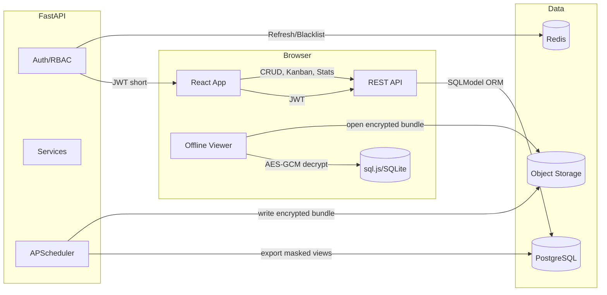

# Australia Mortgage Broker CRM (MVP)

目标：为澳洲房贷经纪小团队搭建云为主 + 本地只读备份的轻量 CRM。后端 FastAPI + SQLModel，前端 React + Vite + TS，PostgreSQL + Redis，支持导出加密离线包与离线只读查看。

执行状态：此仓库已包含后端与前端骨架、核心模型与关键 API、导出作业示例、docker-compose 与环境变量示例，以及架构图与数据流说明。

架构图（Mermaid）



数据流要点
- 登录：邮箱+密码（bcrypt/argon2 可选，当前默认 bcrypt），发放短期 JWT 与 Refresh（HTTP-only）。Refresh 与黑名单存 Redis。
- RBAC：Admin 全局可见；Broker 仅可见 owner=本人 的 Deal/Task；Processor 仅读（可配置策略）。
- 活动日志：对 Deal/Task 更新与阶段流转记录 ActivityLog（实体、字段、旧→新、操作者、IP、时间）。
- 导出：APScheduler 定时任务导出只读视图（已脱敏字段）到 SQLite，使用 AES-256-GCM 加密，产出记录保存至 ExportJob。前端离线页面可解密并以 sql.js 只读浏览。

API 列表（MVP）
- Auth: `POST /auth/register`(Admin)、`POST /auth/login`、`POST /auth/refresh`、`POST /auth/logout`
- Users: `GET /users/me`、`GET/POST/PUT/DELETE /users`(Admin)
- Clients: `GET/POST/PUT/DELETE /clients`（RBAC 行级过滤）
- Deals: `GET/POST/PUT/DELETE /deals`、`POST /deals/{id}/transition`（阶段校验）
- Tasks: `GET/POST/PUT/DELETE /tasks`、`POST /tasks/assign`、`POST /tasks/{id}/complete`
- Stats: `GET /stats/summary`、`GET /stats/funnel`
- Export: `POST /exports/run`(Admin)、`GET /exports`、`GET /exports/{id}/download`

数据表 DDL（SQLModel 生成，简化示例）

```sql
CREATE TYPE user_role AS ENUM ('Broker','Processor','Admin');

CREATE TABLE users (
  id SERIAL PRIMARY KEY,
  email TEXT UNIQUE NOT NULL,
  hashed_password TEXT NOT NULL,
  role user_role NOT NULL DEFAULT 'Broker',
  active BOOLEAN NOT NULL DEFAULT TRUE,
  created_at TIMESTAMPTZ DEFAULT now()
);

CREATE TABLE clients (
  id SERIAL PRIMARY KEY,
  name TEXT NOT NULL,
  contact JSONB,
  notes TEXT,
  pii_masked_fields JSONB DEFAULT '{}'
);

CREATE TYPE deal_stage AS ENUM ('Enquiry','Checklist Sent','Submission','Approval','Settlement');

CREATE TABLE deals (
  id SERIAL PRIMARY KEY,
  client_id INTEGER REFERENCES clients(id) ON DELETE CASCADE,
  owner_user_id INTEGER REFERENCES users(id) ON DELETE SET NULL,
  lender TEXT,
  loan_type TEXT,
  amount NUMERIC(18,2),
  stage deal_stage NOT NULL DEFAULT 'Enquiry',
  tags TEXT[] DEFAULT '{}',
  due_date DATE,
  created_at TIMESTAMPTZ DEFAULT now(),
  updated_at TIMESTAMPTZ DEFAULT now()
);

CREATE TABLE tasks (
  id SERIAL PRIMARY KEY,
  deal_id INTEGER REFERENCES deals(id) ON DELETE CASCADE,
  title TEXT NOT NULL,
  assignee_user_id INTEGER REFERENCES users(id) ON DELETE SET NULL,
  status TEXT NOT NULL DEFAULT 'open',
  priority TEXT DEFAULT 'normal',
  due_date DATE
);

CREATE TABLE activity_logs (
  id SERIAL PRIMARY KEY,
  actor_user_id INTEGER REFERENCES users(id),
  entity_type TEXT NOT NULL,
  entity_id INTEGER NOT NULL,
  action TEXT NOT NULL,
  diff_json JSONB,
  ip TEXT,
  ts TIMESTAMPTZ DEFAULT now()
);

CREATE TABLE export_jobs (
  id SERIAL PRIMARY KEY,
  started_at TIMESTAMPTZ DEFAULT now(),
  finished_at TIMESTAMPTZ,
  status TEXT NOT NULL DEFAULT 'pending',
  file_uri TEXT,
  rows_count INTEGER DEFAULT 0,
  checksum TEXT
);
```

后端与前端目录大纲、关键代码与运行步骤详见下方。

运行快速开始
- 复制 `.env.example` 为 `.env`（或在 docker-compose 使用 env_file）
- `docker-compose up --build` 一键启动：api、frontend、db、redis
- 打开 `http://localhost:5173` 前端；API 文档 `http://localhost:8000/docs`

自测要点（对照验收标准）
- Broker 登录仅能看到自己名下 Deal/Task（API + 前端过滤）
- 看板拖拽更新写入 ActivityLog（含旧/新阶段与操作者）
- /stats/summary 与 /stats/funnel 可用，支持时间区间
- 导出任务可手动与定时执行；离线包可在“离线只读模式”解密查看
- OpenAPI 文档完整；.env.example 齐全；docker-compose 一键起服务
- 单元测试覆盖鉴权、RBAC、导出、阶段流转（tests/）

后端目录结构（摘录）
- `backend/app/main.py` FastAPI 应用实例、CORS、速率限制、路由装配、启动任务
- `backend/app/models/*` SQLModel 数据表模型（User/Client/Deal/Task/ActivityLog/ExportJob）
- `backend/app/schemas/*` Pydantic v2 请求/响应 schema（req/resp 分层）
- `backend/app/api/routes/*` 控制器（auth/users/clients/deals/tasks/stats/exports）
- `backend/app/services/*` 领域服务（auth、audit、exports 等）
- `backend/app/jobs/scheduler.py` APScheduler 定时任务（每 2 小时导出）
- `backend/app/core/*` 配置与安全（JWT、密码哈希）
- `backend/app/db/*` DB 连接/初始化（Alembic 已配置）
- `backend/alembic/*` 迁移配置（建议用迁移上线）

关键样例（RBAC 行级过滤）
- 在 `deps.py` 中的 `broker_row_scope` 为 Broker 返回 `owner_user_id`，其余角色返回 `None`；在 Deals/Tasks 查询时条件化拼接，确保 Broker 仅能看到自己名下的数据。

关键样例（阶段流转活动日志）
- `POST /deals/{id}/transition` 中，写入 `ActivityLog` 记录旧/新阶段与操作者、IP；看板拖拽调用该 API 即可满足留痕。

前端路由与页面骨架
- 路由：`/login`、`/register`、`/`(Kanban)、`/deals/:id`、`/stats`、`/offline`
- 看板：`src/pages/Kanban.tsx`（后续可切换为 dnd-kit 拖拽）
- 离线只读：`src/pages/Offline.tsx` 示例了 AES-GCM 解密与后续加载 sql.js 的入口（当前演示解密流程）

导出作业说明
- 后端：`POST /exports/run`（Admin）会导出 SQLite 只读视图并使用 AES-256-GCM 加密，产物存 `/data/exports/*.enc` 并记录到 ExportJob
- 定时：APScheduler 每 2 小时执行一次（若未设置 AES_KEY_HEX 则跳过）
- 前端：离线页选择 `.enc` 文件，输入口令派生密钥并解密（演示代码使用固定 salt；生产需安全管理密钥）

运行与运维
- 开发：`docker-compose up --build`；首次可在容器内 `alembic revision --autogenerate -m "init" && alembic upgrade head`
- 种子：在 api 容器中 `python -m app.scripts.seed`
- 环境变量：见 `.env.example`（JWT_SECRET、DB_URL、REDIS_URL、AES_KEY_HEX 等）
- 安全：建议生产开启强密码策略、2FA（可引入 TOTP）、IP 黑名单与更细的速率限制
